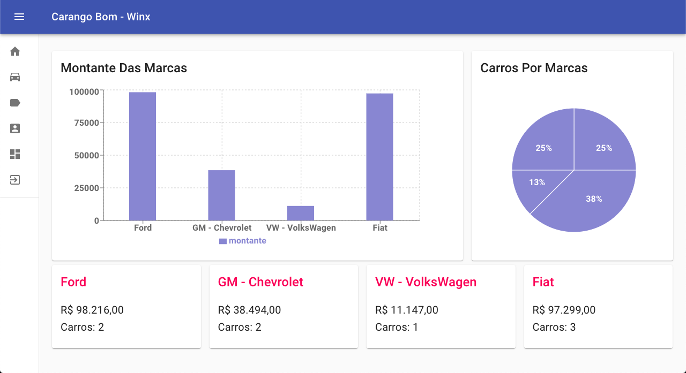

<br />
<p align="center">
  <h3 align="center">Carango Bom Winx</h3>

  <p align="center">
    Sistema de gerenciamento de veículos
    <br />
    <a href="#"><strong>Veja o site online »</strong></a>
    <br />
    <br />
  </p>

  


</p>

# 📌 Índice

- [Sobre o projeto](#sobre)
  - [Feito com](#feito)
- [Features](#features)
- [Iniciando o projeto](#iniciando)
  - [Pré-requisitos](#requisitos-minimos)
  - [Instalação](#instalacao)
  - [API Local](#api-local)
  - [Teste](#testes)

## 💻 Sobre o projeto <a name="sobre"></a>

<p align="center">
  
</p>

O projeto **Carango Bom** é um sistema de gerenciamento de veículos, no qual os administradores de uma concessionária cadastram veículos para venda. Os clientes, então, conseguem ver todos os veículos disponíveis e os detalhes de cada um.

## 📝 Feito com <a name="feito"></a>

- TypeScript
- React
- Jest

## 🖥 Features <a name="features"></a>

- Tela de listagem e exclusão de veículos à venda
- Tela de cadastro e alteração de veículos
- Tela de listagem e exclusão de marcas de veículos
- Tela de cadastro e alteração de marcas de veículos
- Dashboard com relatório da quantidade e valor de veículos disponíveis para venda de cada marca

## 🔴 Iniciando o projeto <a name="iniciando"></a>

### ❗ Pré-requisitos <a name="requisitos-minimos"></a>

Para rodar o projeto é necessário ter os seguintes itens instalados na sua máquina.

- Node
- TypeScript
- JSON Server

### 📥 Instalação <a name="instalacao"></a>

Clone o repositório

```sh
git clone https://github.com/levelup-rchlo/carango-bom-winx.git
```

Instale as dependências rodando o comando

```sh
yarn install
```

Digite o comando para ligar o servidor

```JS
yarn start
```

Acesse a URL http://localhost:3000/

## ⚫️ API Local <a name="api-local"></a>

1. Digite o comando yarn mock para rodar a api localmente

```sh
yarn mock
```

## ✅ Testes <a name="testes"></a>

1. Digite o comando yarn test para rodar os testes

```sh
yarn test
```
